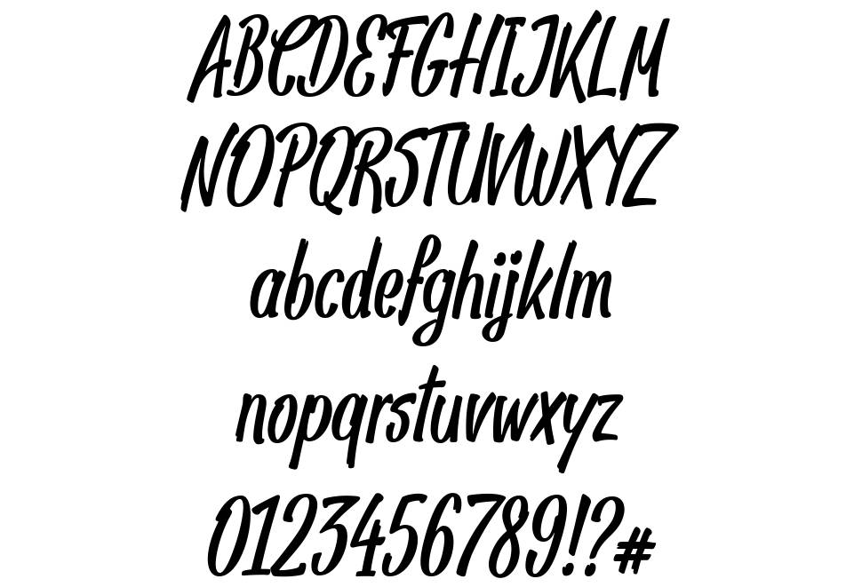
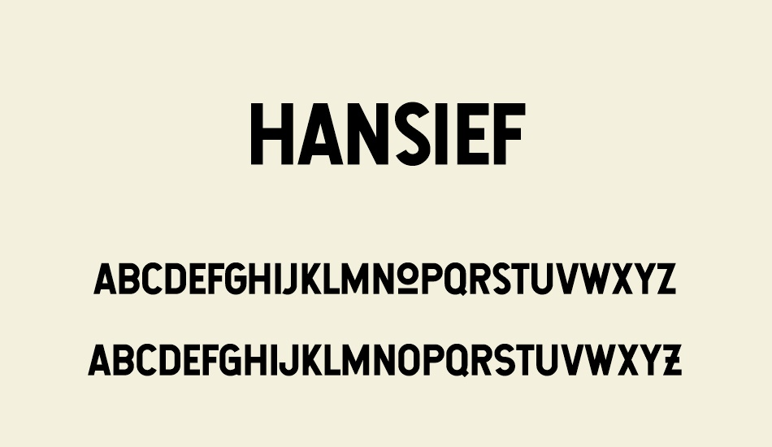

***Pizzas***. Everyone likes it with different ingredients (don’t sweat, we’re not going to discuss the pineapple topic today!), but everyone loves it with a bunch of cheese.

But it’s not the only thing that’s cheesy. What am I talking about? 

Yes, you might already guessed it – I’m talking about pizzerias. Bright colours, amazing smells, and, of course, charismatic Italian vibe. Seems like pizzerias all around the world are exactly the same.

And sure thing, that’s *cheesy*. But you know what’s even *more* *cheesy*? The typography all these pizzerias are using.

As pizzas associate with Italy, no surprise that pizzerias like to use its flag colours. However, it’s no secret that yellow and orange are also often used in pizzeria’s titles, logos, menus. But why and what does it mean?

Here you are – main colours and their explanations:

**Green** is associated with nature. Logos using green convey freshness, growth, and harmony. Pizzerias with this colour can seek to highlight its food quality, fresh ingredients.

**White** is associated with purity. In logos it can mean cleanliness and safety. However, in this case, it’s mostly used as ‘a filler’ colour that makes everything look put-together, in addition, it also represents Italy’s flag colours.

**Red** is associated with passion. It’s often used in logos that are meant to convey desire, adventure, high energy, and just a touch of danger. As pizzas are considered to be fast food, red represents that energy. In addition, it’s shown to stimulate appetite. 

**Orange** is often called ‘a little bit more subtle red’. It manages to draw attention without such high associations with desire or danger. However, being a citrus colour, it’s shown to stimulate appetite.

**Yellow** is a bright, energetic color associated with joy and lightheartedness. This color arouses cheerfulness. Pizzerias that use this colour can also use it in order to stimulate appetite.

Nevertheless, not only colours can help to spot the pizzerias. There’s also a pattern at it’s font I’d love to share with you. Here’s some most popular fonts that pizzerias like to use:

**Lobster**. Its bold nature gives it a more casual cursive font feel, and that makes this font interesting and playful.

**Pan Pizza**. Not only does it bring us back to the day when posters were handwritten, but also gives that informal and cheerful feeling.

**Hansief Rough**. Rough edges and a worn-out texture creates a warm and comfy atmosphere that we all want while eating in a pizzeria.

Sources:

https://findthatlogo.com/10-major-pizza-chain-brands-logos/

https://blog.logomyway.com/understanding-meaning-colors-logo-designs/

https://www.manypixels.co/blog/post/pizza-font

https://fr.cooltext.com/download-Font-Lobster

https://www.fontriver.com/font/pan_pizza/

https://www.freebestfonts.com/hansief-font