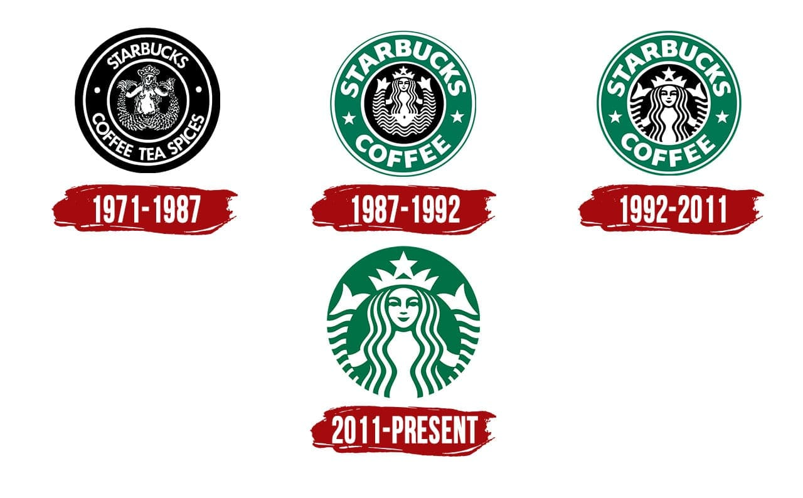
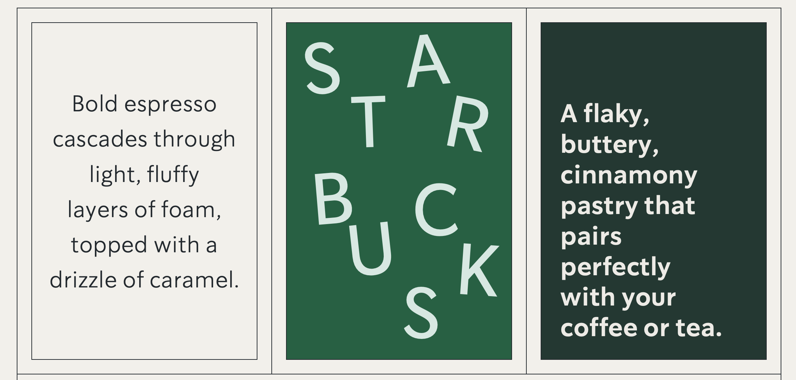
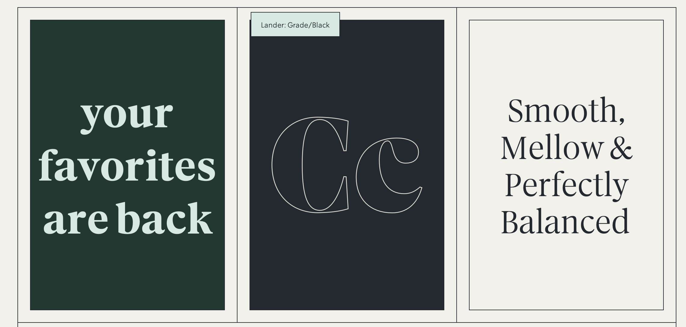
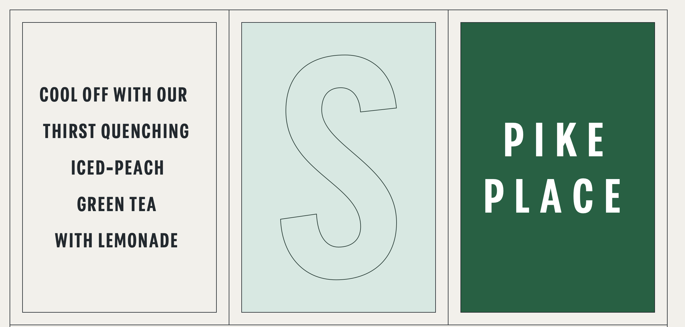

***Starbucks.*** \
\
The name that almost everyone heard at least once. With more than 32,000 stores all around the globe, Starbucks is the premier roaster and retailer of specialty coffee in the world. There’s no secret – this brand has something special that catches all of us.\
*But what makes it so iconic? What invites people to come, try and, lastly, stay?*\
\
Of course, there’s no one answer. Every coffee lover would probably give a different opinion on that. However, I can also give mine.\
\
I think that the atmosphere plays a significant role in it. As Starbucks say themselves, it’s about *the connection*.

> We make sure everything we do honours that connection – from our commitment to the highest quality coffee in the world, to the way we engage with our customers and communities to do business responsibly.

\
And what does it have to do with typography, you may ask. Here’s the answer – typography helps to create identity and maintain the image of the brand.\
\
Since the cafe was founded in 1971, Starbucks hasn't changed its logo image that much.

Same legendary girl, same circle, same vibe. But hey, where’s the title?As the brand is known worldwide, it doesn’t need the title included in the logo any more. And even though some people would argue that typography isn’t needed any more too, I’d highly disagree.You can’t really escape the typography – the name of Starbucks always welcomes you when you’re coming to the cafe. The board with different names of drinks pops in front of your eyes. The interior design welcomes you with various images of catchy phrases, written in specific font. It seems, everything has its own unique style.As the brand is trying to move away from hand-lettering (which actually perfectly creates the ‘connection’, in my opinion!), they incorporate custom modifications to these typefaces where an artful touch is needed. As Starbucks reveal themselves, they use three fonts:\
**\
Sodo Sans.** It’s frequently used for body copy.

**\
Lander.** A perfect accent for more expressive moments.

**\
Pike.** Works for functional headlines and wayfinding.

The typography Starbucks has chosen creates a cozy, pleasant and warm impression. It means, it makes the ‘connection’ they try to have with every coffee lover.To conclude, even if the title of the brand isn’t necessary in the logo anymore, typography is still a useful tool to create brand identity and maintain its image.\
\
Sources:\
\
https://www.starbucks.co.uk/about-us\
https://creative.starbucks.com/typography/ \
https://www.theverge.com/2020/10/30/21540908/starbucks-app-q4-earnings-mobile-payments\
https://www.fastcompany.com/90394468/starbucks-just-publicly-deconstructed-its-brand-heres-why