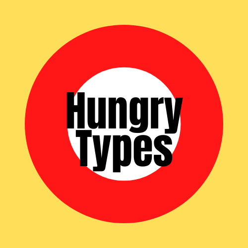
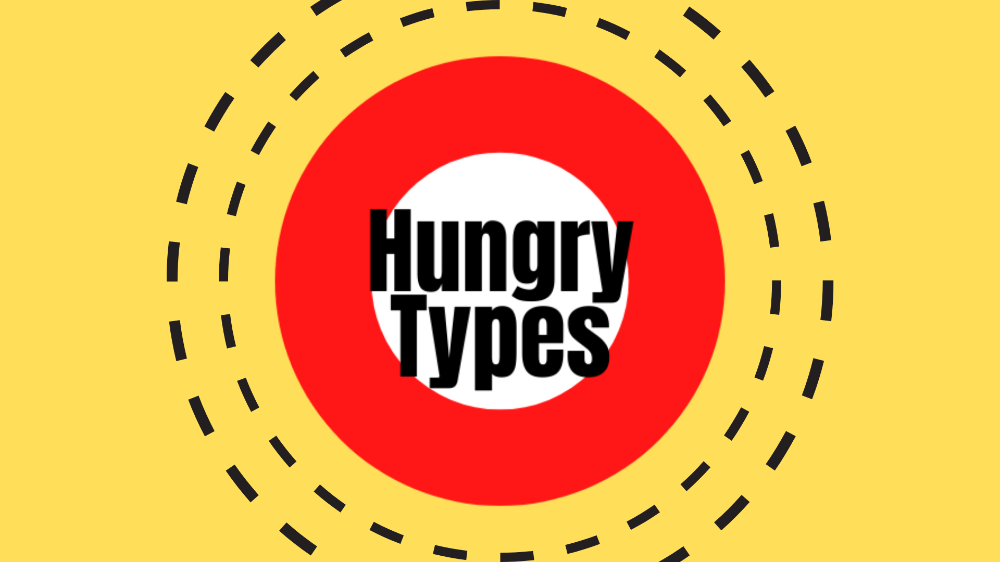

You love to eat? I love to talk about the typography of the places you eat in. We already have something in common, don't we? :) \
\
I created this blog to explore the way texts look in different spots you eat in. Cafés, buffets, fast food places, or fancy restaurants – they all have their own unique style of presenting themselves. Various fonts, colours, and even sizes can portray the atmosphere of the place you're planning to go to. And you don't even have to come inside to find it out!\
\
Want to learn this superpower? Follow the blog. *Let's dive into the pool of typography together!*

## My logo image & title of the blog

I attempt was to make my blog bright, playful and simple. So, I decided to create my **logo** image from:

* **TITLE**. The name of the blog is "Hungry Types", and it gives the sense of curiosity of what kind of blog it is. So, I wanted to include it into the logo. As my wish was to keep everything fresh, simplistic, and exciting, for that, I chose easy-to-read black Anton font text.
* **YELLOW SPACE**. As my logo is the square, to fill it I chose yellow. Not only yellow perfectly represents the cheerfulness of the blog, but also it associates with the topic I am writing – food. 
* **RED & SMALLER WHITE CIRCLES**. I chose circles as they could be easily associated with pizzas – one of the main representations of food, so, with the theme of the blog too. Red gives the logo some energy and attractiveness (and also associates with food! Don't you feel hungry yet?), and white neatly contrasts with all other colours and keeps it simple.

## My banner image

\
As my goal was to keep everything simple, I didn't want to add a lot of new details to the banner. In order to keep everything balanced, I chose the same yellow space, and I put the logo in the middle of it. To keep things exciting, I added black punctured lines (as it matches the logo and the blog itself) around the logo.

